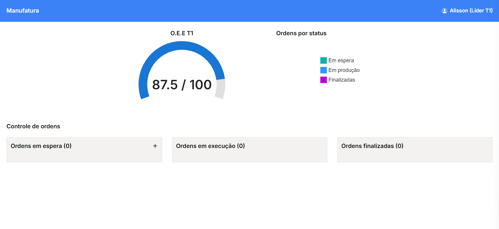
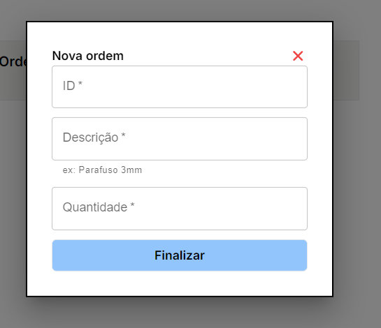

# Manufactoring Dashboard

This project aims to provide a solid KANBAN JIT Based app for working with manufactoring factory teams.

## TEAM QUICK LINKS

[Whimscal mind map](https://whimsical.com/B2FktP3iy9spEvrC19wmCj)  
[Deployment on Vercel](https://manufactoring-git-main-jvrl18s-projects.vercel.app/)

## Interface

## Running it locally

1 - Clone this repository  

2 - Have [NodeJS](https://nodejs.org/en) 20x+ Installed.  

3 - Edit .env.example file with your mongoDB uri and rename it to `.env.local`  
3.1 - If you do not have a MongoDB URI install it with docker `docker pull mongo:latest`  
3.2 - Run mongodb locally `docker run -d -p 27017:27017 --name=mongo-local mongo:latest`

4 - Install dependencies on CLI `npm i -g yarn && yarn`

5 - Run project `yarn dev`

Further instructions will be displayed on the CLI